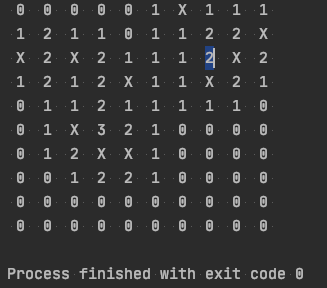

# 지뢰찾기
> 지뢰찾기 게임을 위한 각 블록의 '숫자' 출력 애플리케이션

### 구현 시나리오
 1. 전체 보드를 '0'으로 초기화 
 2. 주어진 지뢰 수 만큼 랜덤 위치에 지뢰 설치
    - 랜덤 선정한 위치에 지뢰가 없는 경우
        + 지뢰 설치
        + 잔여 지뢰 수 - 1
        + (*3) 지뢰 주변 블록의 지뢰 카운트 수 증가
    - 지뢰가 있는 경우
        + 잔여 지뢰 수 유지
        
 3. 지뢰 주변 블록의 지뢰 카운트 수 증가
    - 지뢰 좌표 값 주변의 8개 블록의 블록 값 +1 증가  
      (지뢰 수를 계산할 수 있는 없는 범위) 
        + 범위 내에 지뢰가 있는 경우 해당 위치는 증가 제외 
        + 조회 범위가 전체 보드 사이즈 범위를 넘는 경우 증가 제외
        
 4. 출력
 
